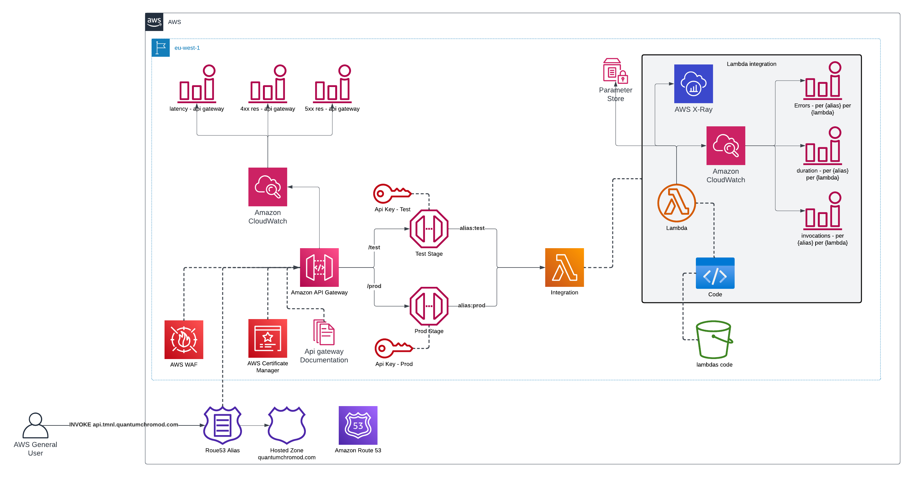

# Introduction

Here, two architectures are presented that define a REST API. The different architectures involve:

1. REST Api Gareway with AWS Lambda integrations
2. Fargate + CI/CD Pipeline

Both architectures are High Available by design with auto scaling (lambdas by default and fargate with app autoscaling)

Structured of the repo:

```
├── Makefile
├── README.md
├── img
│   └── ...
├── scripts
│   └── ...
└── terraform
    ├── _lambdas
    │   └── replace-strings
    │       ├── main.py
    │       └── requirements.txt
    ├── _modules
    │   └── api-gateway-integration
    │       └── ...
    ├── api-gateway
    │   └── ...
    ├── fargate
    │   └── ...
    └── ...
```

#### Terraform folder

In the `terraform` folder we can find the IaC to deploy the APIs using the two different methods. The module that are used in the root of the `terraform` folder are provided in the `terraform/api-gateway` and `terraform/fargate` folders. Other helper modules can be found in the `terraform/_modules` folder.

For the REST Api gateway lambda functions, there is another folder `terraform/_lambdas` which is supposed to contain all the lambda integrations for the API gateway.

#### Scripts folder

In the script folder there is a `main.py` (with its `requirements.txt`) which can be used to query the API endpoints in the following way:

1. First export the following variables:
   
   ```sh
   export API_ENDPOINT=<api_endpoint>
   export API_KEY=<api_key>
   ```

2. Then, launch the python scrypt:

    ```sh
    python3 scripts/main.py query \
        -x POST \
        -path test/string/replace \
        -body '{"content": "<my content>"}'
    ```


#### Makefile

The makefile is used to deploy the terraform code. The Makefile will pass the backend configuration to Terraform, which is in part defined in the Makefile itself, and in part is defined in my AWS account. In order to not expose my Bucket name, I defined an AWS Parameter store parameter called `/terraform/statefiles/bucket` containing the bucket name.

## Deployed and tested With

| Tool      | Version   |
|-----------|-----------|
| Terraform | 1.5.7     |
| GNU Make  | 3.81      |
| Docker    | 24.0.7    |
| Python    | 3.11.6    |

# Terraform Structure

The following choices have been made while creating the modules:

1. Every module takes as input variables at least:

    1. `identifier` -> Should identity with a human friendly name the usage of the module / deployment
    2. `environment` -> The supposed environment in which we are deploying resources
    3. `suffix` -> A unique random id which allows to make sure that the resources created in the deployment have no conflicting names with other deployments

# REST Api gateway

The following is the underlying architecure:



## Features

1. AWS REST Api gateway
2. Custom domain with ACM certificate
3. 2 Stages: `test` and `prod`
4. Lamdbas packages automatically built and uploaded to S3
5. `test` stage points to `$LATEST` versions of lambdas
6. `prod` stage points to custom versions of lambdas
7. 2 Api keys, one per stage
8. 2 Api usage plans, one per stage
9. Path and query parameters validation
10. Automatic API documentation for the integrations
11. Body validation (with `Content-Type: application/json`)
12. Cloudwatch Alarms for each lambda alias (`test` and `prod`) on:
    1.  Error count
    1.  Duration of execution
    2.  Number of invocations

13. Cloudwatch Alarms for the api gateway on:
    1.  Latency
    2.  `4xx` returned
    3.  `5xx` returned

## Description

This implementation contains all the necessary components to deploy a REST API in AWS with Lambda integrations.

All the lambda integrations are defined using Terraform local variables (see [here](./terraform/api-gateway/lambdas_def.tf)) containing all the necessary information to create both the lambda function itself and the resources for the integration in the api gateway. In particular, these local variables have the following structure:

```
<identifier_of_the_lambda> = {
    lambda = {
        <Information for the lambda itself>
    }
    integration = {
        <Information for creating the integration in the API gateway>
    }
    aliases = {
        <Map of Api stages to lambda versions>
    }
}
```

These definitions are used in the [api-gateway-integration module](./terraform/api-gateway/api_integration.tf), where some defaults are assigned in case some of the parameters are omitted.

# Fargate

The following is the underlying architecture:


## Features

1. AWS ECS Fargate
2. CI/CD Pipeline using:
   1. CodeStar connection to Github to source code on push
   2. CodeBuild to build container
   3. CodeDeploy to Blue/Green deploy new revision to Fargate
3. ECR to store the images
4. Elastic Load balancer in front of the Fargate
5. Custom CNAME and TLS certificate in ACM
6. WAF associated with the load balancer to increase protection
7. Complete network setup:

   1. 
8. Automatic scaling of Fargate containers based on CPU and Memory usage

## Description