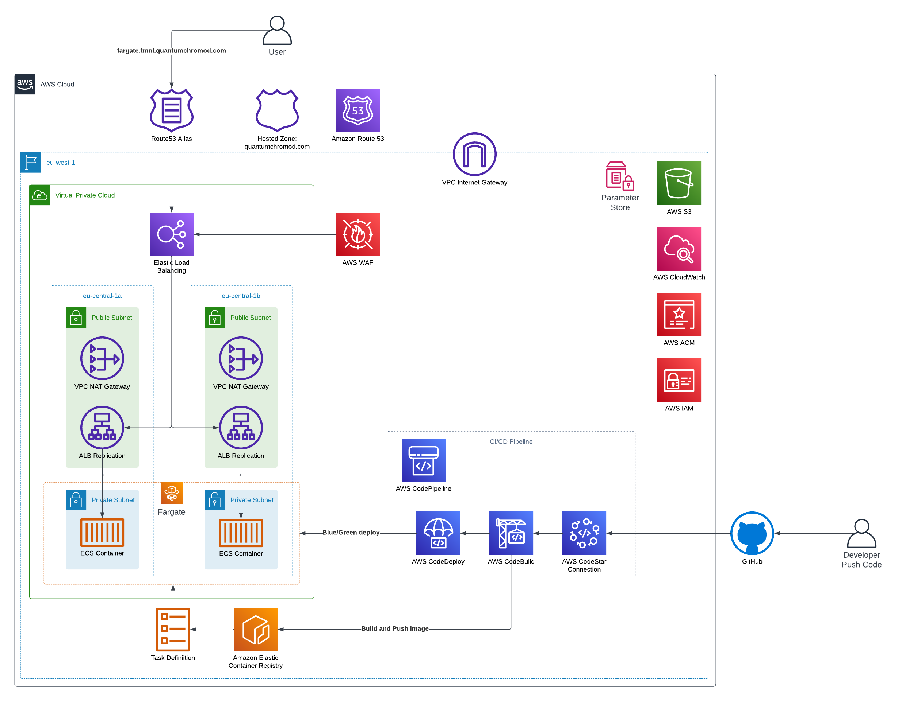

# API Architectures with Terraform on AWS

## Introduction

Here, two different AWS architectures are presented defining a REST API. 

In particular:

1. REST Api Gateway with AWS Lambda integrations (in Python). Lambdas are found [here](./terraform/_lambdas/)

2. Fargate + CI/CD Pipeline (with application written in NodeJS - Typescript using ExpressJS). The Application can be found [here](https://github.com/KevinDeNotariis/fargate-api-sample)

These are deployed at the same time in the [main.tf](./terraform/main.tf)

Structure of the repo:

```
.
├── Makefile
├── README.md
├── infracost-breakdown.txt
├── infracost.yml
├── img
│   └── ...
├── scripts
│   └── ...
└── terraform
    ├── _lambdas
    │   └── replace-strings
    │       ├── main.py
    │       └── requirements.txt
    ├── _modules
    │   └── api-gateway-integration
    │       └── ...
    ├── api-gateway
    │   └── ...
    ├── fargate
    │   └── ...
    └── ...
```

#### Infracost

With the [infracost-breakdown.txt](./infracost-breakdown.txt) we can have an idea of how much the infrastructure costs per month. This breakdown does not consider all costs that are based 'per use', like the cloudwatch logs costs or the api gateway invocation, lambda invocation, S3 storage etc.. These can be customized in the [infracost.yml](./infracost.yml) and used with another `infracost breakdown` to have a more realistic idea of the cost. Ideally, one would create three types of usage, a `low` usage, `medium` and `high` to see how much the costs actually increase based on the number of requests (considering also the fact that more requests => more logs).

#### Terraform folder

In the `terraform` folder we can find the IaC to deploy the APIs using the two different methods. The modules that are used in the root of the `terraform` folder are provided in the `terraform/api-gateway` and `terraform/fargate` folders. Other helper modules can be found in the `terraform/_modules` folder.

For the REST Api gateway lambda functions, there is another folder `terraform/_lambdas` which is supposed to contain all the lambda integrations for the API gateway.

#### Scripts folder

In the script folder there is a `main.py` (with its `requirements.txt`) which can be used to query the API endpoints in the following way:

1. First export the following variables:
   
   ```sh
   export API_ENDPOINT=<api_endpoint>
   export API_KEY=<api_key>
   ```

2. Then, launch the python scrypt:

    ```sh
    python3 scripts/main.py query \
        -x POST \
        -path test/string/replace \
        -body '{"content": "<my content>"}'
    ```


#### Makefile

The makefile is used to deploy the terraform code. The Makefile will pass the backend configuration to Terraform, which is in part defined in the Makefile itself, and in part is defined in my AWS account. In order to not expose my Bucket name, I defined an AWS Parameter store parameter called `/terraform/statefiles/bucket` containing the bucket name.

There are different targets for the main terraform operations, the `terraform-<something>` will cleanup first the `.terraform` and `terraform.lock.hcl` and run a clean `terraform init`. While the `terraform/<something>` will just run the command.

A terraform init + apply can be run with:

```sh
make terraform-apply
```

Or by splitting the operations:

```sh
make terraform/clean
make terraform/init
make terraform/apply
```

To run an infracost breakdown (you will need to have infracost and also be 'logged in', namely acquired a token):

```sh
make infracost/breakdown
```

### Terraform Structure

The **fargate** and **api gateway** deployments are aggregated in the [main.tf](./terraform/main.tf). In that root folder, some of the common resources are also deployed like the [waf](./terraform/waf.tf), the [parameter store parameter](./terraform/parameter_store.tf) and a Network setup (also in the `main.tf`, which is actually only used by the Fargate deployment).

Every module takes as input variables:

 1. `identifier` -> Should identify with a human friendly name the usage of the module / deployment;
 2. `environment` -> The supposed environment in which we are deploying resources;
 3. `suffix` -> A unique random id which allows to make sure that the resources created in the deployment have no conflicting names with other already present AWS resources.

## Common Resources

### Parameter Store

[parameter_store.tf](./terraform/parameter_store.tf)

Contains a map where the keys are the strings that needs to be replaced with the values.

### Waf

[waf.tf](./terraform/waf.tf)

Defines the Waf Web ACL with the following rules:

- IP rate limit of 1000 per 5 minutes;
- Block malicious known IPs (`AWSManagedRulesAmazonIpReputationList`);
- Protection against some common exploitations and vulnerabilities (`AWSManagedRulesCommonRuleSet`).

Metrics and logging are enabled for each rule, so we can check all the blocked/allowed requests and create nice dashboards with the metrics at hand.

## REST Api gateway

The following is the underlying architecure:


### Features

1. AWS REST Api gateway
2. Custom domain with ACM certificate
3. Two Stages: `test` and `prod`:
   1. Two Api keys, one per stage
   2. Two Api usage plans, one per stage
4. Lamdbas packages automatically built and uploaded to S3
5. `test` stage points to `$LATEST` versions of lambdas
6. `prod` stage points to custom versions of lambdas
7.  Path and query parameters validation
8.  Automatic API documentation for the integrations
9.  Body validation (with `Content-Type: application/json`)
10. Cloudwatch Alarms for each lambda alias (`test` and `prod`) on:
    1.  Error count
    2.  Duration of execution
    3.  Number of invocations
11. Cloudwatch Alarms for the api gateway on:
    1.  Latency
    2.  `4xx` returned
    3.  `5xx` returned
12. AWS X-Ray to trace requests flows
13. No authorizer

### More Details

This implementation contains all the necessary components to deploy a REST API in AWS with Lambda integrations, where the lambdas can be found in [_lambdas folder](./terraform/_lambdas/)

All the lambda integrations are defined using Terraform local variables (see [here](./terraform/api-gateway/lambdas_def.tf)) containing all the necessary information to create both the lambda function itself and the resources for the integration in the api gateway. In particular, these local variables have the following structure:

```
<identifier_of_the_lambda> = {
    lambda = {
        <Information for the lambda itself>
    }
    integration = {
        <Information for creating the integration in the API gateway>
    }
    aliases = {
        <Map of Api stages to lambda versions>
    }
}
```

These definitions are used in the [api-gateway-integration module](./terraform/api-gateway/api_integration.tf), where some defaults are assigned in case some of the parameters are omitted.

In the `api-gateway-integration` module, the lambda function itself is created (built and uploaded to S3 making use of the [terraform-aws-modules/lambda/aws module](https://registry.terraform.io/modules/terraform-aws-modules/lambda/aws/latest)) alongside the method, integration, model definition, aliases and documentation resoruces. Moreover, three cloudwatch alarms are created per lambda alias which will alert in case of errors, too long invocation time and too many invocations.


## Fargate

The following is the underlying architecture:



### Features

**Infrastructure**

1. AWS ECS Fargate
2. CI/CD with CodePipeline using:
   1. CodeStar connection to Github to source code on push and trigger the pipeline
   2. CodeBuild to build container
   3. CodeDeploy to **Blue/Green** deploy new revision to Fargate
3. ECR to store the images
4. Elastic Load balancer in front of the Fargate
5. Custom CNAME and TLS certificate in ACM
6. WAF associated with the load balancer to increase protection
7. Complete network setup
8. Automatic scaling of Fargate containers based on CPU and Memory usage (triggered when above 70%)

**Application**

It can be found here: [Fargate Api Sample](https://github.com/KevinDeNotariis/fargate-api-sample)

1. NodeJS with Typescript
2. ExpressJS for API server implementation
3. Authentication via API key generated at infrastructure deployment time
4. Unit tests with Mocha and Chai(-http)
5. Logging with Winston
6. Custom Error Handling route
7. Dockerfile building the container image
8. Buildspec definition for CodeBuild in order to build the image and push it to the ECR registry

### More Details

The Fargate module makes use of a bunch of other modules (from my github, in particular: [terraform-modules](https://github.com/KevinDeNotariis/terraform-modules)), in particular, by taking a look at [main.tf](./terraform/fargate/main.tf) in the `terraform/fargate`, we can appreciate the usage of the following modules:

- `sns` -> Creates an SNS topic and subscribes an email. This SNS will receive notifications regarding the cloudwatch alarms, codepipeline events and app autoscaling events.
- `loadbalancer` -> Creates an Application Load Balancer with two target groups for Blue/Green deployment, Route53 CNAME and ACM certificate.
- `ecs` -> Creates the ECS Fargate cluster, ECR repo to store the images, link the cluster to the load balancer and set the deployment type to be CodeDeploy.
- `autoscaling_ecs` -> Creates the app autoscaling which will autoscale the number of containers in the Fargate Task whenever the CPU or Memory goes above 70%.
- `codepipeline` -> Creates the Codepipeline pipeline which will source (and be triggered by) the repo in github `KevinDeNotariis/fargate-api-sample`, build the docker image and push to ECR in CodeBuild stage and then Blue/Green deploy in the CodeDeploy stage.


## Tools Versions

| Tool      | Version   |
|-----------|-----------|
| Terraform | 1.5.7     |
| GNU Make  | 3.81      |
| Docker    | 24.0.7    |
| Python    | 3.11.6    |
| NodeJS    | v21.1.0   |